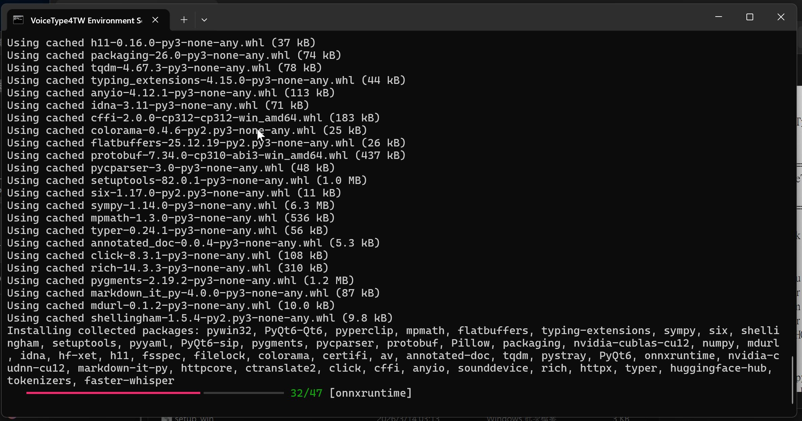
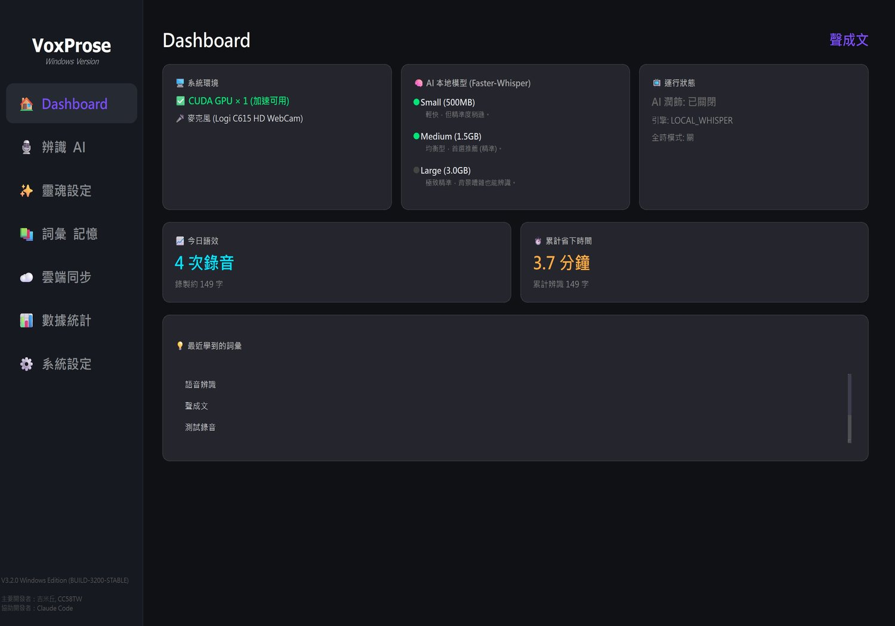
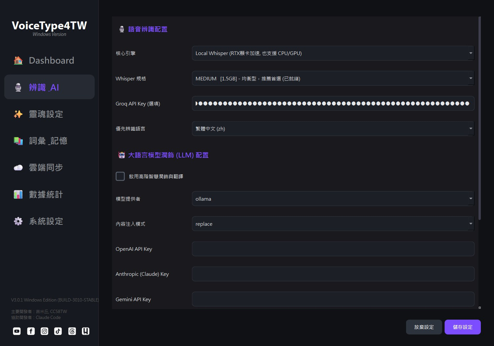
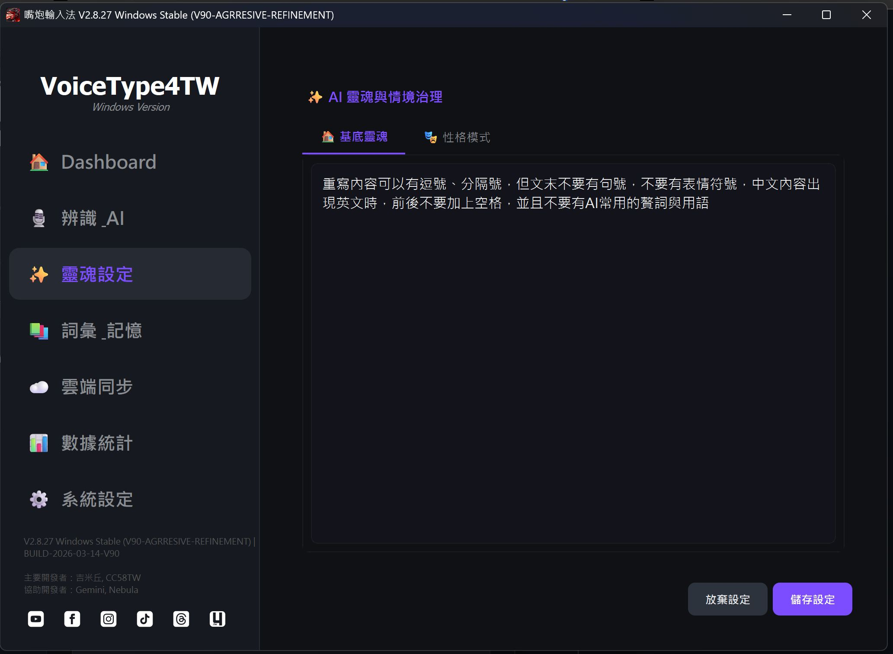
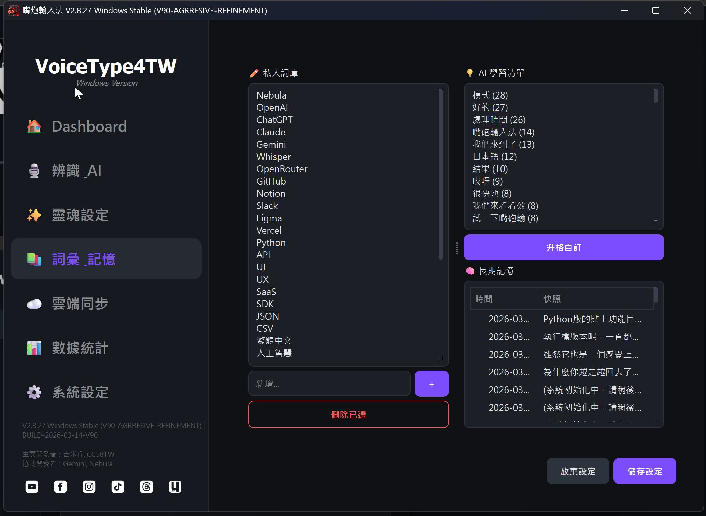
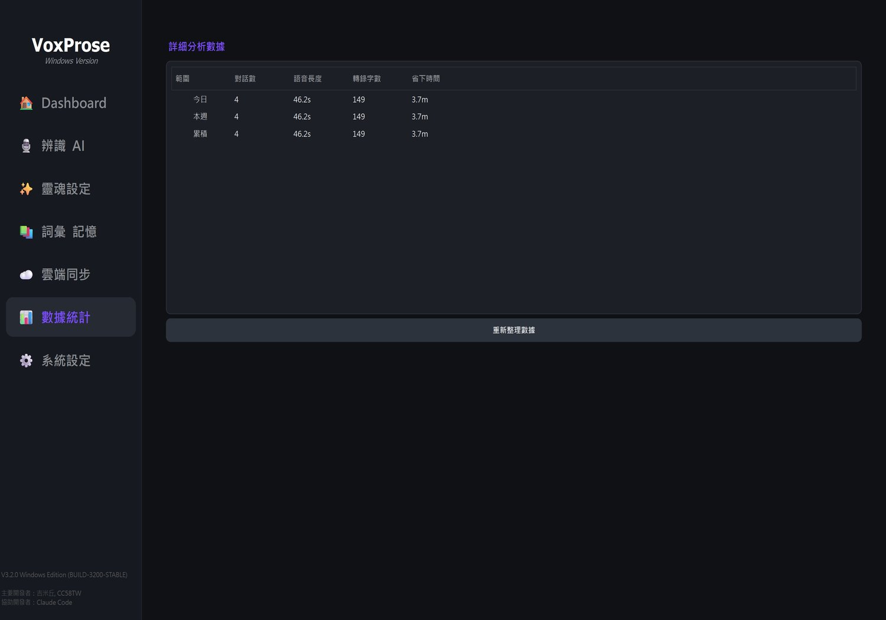
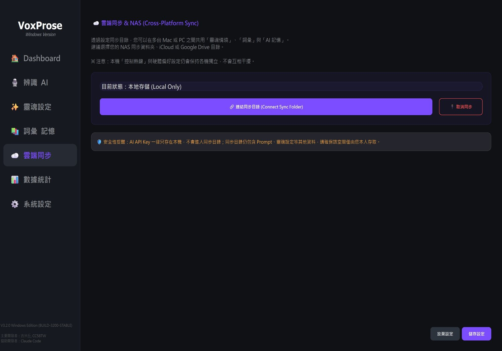

# VoiceType4TW 嘴炮輸入法 — Windows 專用版

**讓你出一張嘴就能打字的本地語音輸入法**：本地 Whisper 辨識（支援 CUDA 加速）＋可選的 AI 潤飾翻譯，文字直接注入你正在打字的視窗。

- 原作者：**吉米丘, CC58TW**（[原專案 jfamily4tw/voicetype4tw-mac](https://github.com/jfamily4tw/voicetype4tw-mac)）
- Windows 專用版維護：go-mask ｜ 協助開發：Claude Code

> **📌 本分支為 Windows 10/11 專用版（V3.0.1）**——已移除所有 macOS 專屬程式碼，針對 Windows 深度優化安裝流程與相容性：一鍵自我安裝、免黑窗原生啟動器、CUDA 條件安裝、免按鍵全時模式。macOS 版請至上方原作者專案。

---

## 🚀 快速安裝（三步驟，不需要懂程式）

**1. 下載 ZIP**：[👉 點我直接下載](https://github.com/jfamily4tw/voicetype4tw-mac/archive/refs/heads/win-go-mask-202607.zip)（或按上方綠色 **Code** 按鈕 → **Download ZIP**）

**2. 解壓縮**到簡單的路徑，例如 `D:\VoiceType4TW`（請避開 `C:\Program Files`，寫入權限不足會被環境檢查擋下）

**3. 雙擊 `setup_win.bat`**，接下來全自動：
- 沒裝 Python？自動下載可攜式 Python（免管理員權限、不污染系統）
- 有 NVIDIA 顯示卡自動啟用 CUDA 加速，沒有就用 CPU 模式（省 800MB 下載）
- 自動下載語音辨識模型（約 1.5GB）、編譯啟動器、建立桌面捷徑



需要網路，視網速約 10～30 分鐘。完成後雙擊桌面「**嘴炮輸入法**」捷徑即可使用。

> 💡 若雙擊時 Windows 跳出藍色「已保護您的電腦」視窗，點「其他資訊」→「仍要執行」即可（網路下載的檔案都會如此，之後不會再出現）。
> 疑難排解請見下方「安裝失敗排除」章節與 [安裝下載教學](安裝下載教學.MD)。

---

## 功能特色

- **🖥️ Windows 深度優化**：一鍵自我安裝、原生 `VoiceType4TW.exe` 啟動器免黑窗、CUDA／CPU 自動判斷。
- **⌨️ 全域快捷鍵**：按住說話 (PTT，預設右 Alt) 或切換開關 (Toggle)，反應迅速不卡頓。
- **🎤 全時模式**：免按鍵自動觸發——偵測到你開口就自動錄音、講完自動辨識輸出（浮動選單一鍵開關）。
- **🧠 本地辨識**：Faster-Whisper 在你自己的電腦上跑，不需上傳語音；也可切換 Groq／Gemini 等雲端引擎。
- **✨ 三層式靈魂系統**：基底靈魂＋情境模板＋輸出格式，打造個人化 AI 風格。
- **🌐 即時翻譯**：講中文直接輸出英文／日文，可與靈魂情境疊加。
- **📚 智慧詞彙**：手動維護專有名詞，出現三次以上自動學習；每週自動濃縮長期記憶。
- **📍 位置記憶**：錄音指示器與浮動按鈕可拖曳，記住你在每個螢幕的偏好停靠位置。
- **☁️ 雲端同步**：設定與詞庫可放進 iCloud／Google Drive／NAS 同步資料夾，多台電腦共用。
- **🎯 不搶焦點**：文字直接注入當前輸入位置，同時複製到剪貼簿備援。

---

## 介面導覽

### Dashboard 總覽



一眼掌握系統環境（GPU／麥克風）、模型狀態、今日語效與累計省下的時間。

### 浮動錄音指示器


- 無「AI」字樣：直接辨識輸出；有「AI」字樣：經 LLM 潤飾後輸出
- 黃色：辨識處理中；翻譯模式會顯示目標語言
- 可直接拖曳到你喜歡的位置，每個螢幕分別記憶

### 辨識與 AI 設定



選擇語音引擎（本地 Whisper／Groq／Gemini／OpenRouter）、模型大小，以及 AI 潤飾使用的 LLM（Ollama 本地或 OpenAI／Claude／Gemini 等雲端）。

### 靈魂治理：三層疊加



1. **🏠 基底靈魂**：AI 的核心價值觀——不廢話、修正錯字、繁體中文輸出
2. **🎭 情境模板**：特定場合的風格——`💼 商務回應`、`🌐 商務英文`、`📱 社群貼文`、`🎓 情商大師`
3. **📝 輸出格式**：電子郵件、條列筆記、Markdown 表格……

浮動按鈕選單隨時切換組合，讓輸入法變成你的私人助理。

### 詞彙與記憶



手動新增專有名詞（品牌名、人名），同一個詞出現三次以上自動記錄；長期記憶每週自動濃縮歸檔，可逐筆檢視、刪除。

### 數據統計



記錄語音輸入次數與長度，換算成「幫你省下多少打字時間」。

### 雲端同步



把資料目錄指向你的同步資料夾（iCloud／Google Drive／NAS 皆可），詞庫與設定就能跨電腦共用。

---

## 工作流程

1. 按住快捷鍵講話（或開啟 🎤 全時模式直接講）
2. 本地 Whisper（或雲端引擎）辨識語音
3. 可選：交給 LLM 潤飾語氣、套用靈魂情境、翻譯
4. 結果自動注入目前游標所在的輸入框（剪貼簿同步備援，`Ctrl+V` 可再貼）

---

## 設定

設定檔位於 `%APPDATA%\VoiceType4TW\`（`config_local.json` 為本機設定、`config_global.json` 參與雲端同步），大多數選項都可以直接在應用程式的設定視窗調整：

| 欄位                       | 說明                                                    | 預設值          |
|----------------------------|---------------------------------------------------------|-----------------|
| `hotkey_ptt`               | 按住說話快捷鍵 (alt_r / ctrl_r / shift_r / f13-f15 / code:VK) | `alt_r`     |
| `hotkey_toggle`            | 切換開關快捷鍵                                          | `f13`           |
| `auto_trigger_enabled`     | 🎤 全時模式（免按鍵自動觸發）                            | `false`         |
| `auto_trigger_sensitivity` | 全時模式觸發門檻 (0~1，越高越不敏感)                     | `0.15`          |
| `auto_trigger_silence_sec` | 全時模式靜音幾秒視為一句結束                             | `1.5`           |
| `stt_engine`               | 語音引擎 (local_whisper / groq / gemini / openrouter)   | `local_whisper` |
| `whisper_model`            | Whisper模型大小 (tiny/base/small/medium/large)          | `medium`        |
| `groq_api_key`             | Groq API Key (使用groq引擎時填入)                       | `""`            |
| `llm_enabled`              | 是否啟用AI文字潤飾                                      | `false`         |
| `llm_engine`               | LLM引擎 (ollama / openai / claude / openrouter / gemini / deepseek / qwen) | `ollama` |
| `language`                 | 辨識語言                                                | `zh`            |

---

## 系統需求

- **Windows 10/11**（Python 3.10–3.12；沒裝 Python 也沒關係，`setup_win.bat` 會自動下載可攜式 Python 3.12，不需要系統管理員權限）
- **顯示卡**：有 NVIDIA GPU 自動安裝 CUDA 加速；沒有則自動改用 CPU 模式
- **記憶體**：建議 16GB 以上
- **磁碟空間**：約 5GB（含辨識模型）

---

## 🛠️ 安裝失敗排除

若執行 `setup_win.bat` 時卡在「建立虛擬環境」或「安裝依賴」階段，通常與 **磁碟寫入權限** 有關。

**❌ 常見成因：安裝在受保護目錄**
- 路徑在 `C:\` 根目錄、`C:\Program Files` 或 `C:\Program Files (x86)`
- Windows 會限制未授權腳本在這些位置寫入大量小檔案

**✅ 解決方案（擇一）：**
1. **更換安裝路徑（推薦）**：整個資料夾移至 D 槽等非系統磁碟，例如 `D:\Tools\VoiceType4TW`
2. **移到使用者資料夾**：只有 C 槽的話，放在 `C:\Users\<你的名稱>\Documents` 或桌面
3. 對 `setup_win.bat` 按右鍵 →「以系統管理員身分執行」

模型下載卡住的手動處理方式請見 [安裝下載教學](安裝下載教學.MD)。

---

## 開發者專區

### 手動安裝（需 Python 3.10–3.12）

```bat
git clone -b win-go-mask-202607 https://github.com/jfamily4tw/voicetype4tw-mac.git
cd voicetype4tw-mac
py -3.12 -m venv venv
venv\Scripts\activate
pip install -r requirements-win.txt
pip install -r requirements-cuda-win.txt   rem 有 NVIDIA GPU 才需要
python main.py
```

### 打包真可攜版（解壓即用 ZIP）

```powershell
.\release_win.ps1          # Full：含 CUDA + medium 模型（約 4GB，離線可用）
.\release_win.ps1 -Lite    # Lite：無 CUDA 無模型，首次啟動線上下載（約 300MB）
```

產出在 `dist\`，對方解壓後雙擊 `VoiceType4TW.exe` 即可使用（免裝 Python、隨身碟可帶著走）。

### 開發文件

- [VERSIONS.md](VERSIONS.md) — 完整版本演進紀錄
- [windows_cuda_qt_crash_postmortem.md](windows_cuda_qt_crash_postmortem.md) — PyQt6 × CUDA 載入順序地雷（改 `main.py` 前必讀）
- [quality_control_checklist.md](quality_control_checklist.md) — 發版前 QC 清單

---

## ❤️ 支持原作者

嘴炮輸入法由 **吉米丘** 與女兒 **CC58TW** 原創開發。如果這套工具對你有幫助，歡迎：

- 在 GitHub 按顆 ⭐ 支持
- 分享給常打字、開會做紀錄、寫文件的朋友
- [請吉米喝杯咖啡，支持持續開發](https://hi.jimmy4.tw/support)

**咖啡版**（含多重靈魂自訂等進階功能）：
[Mac 免費版](https://portaly.cc/jimmy4tw/product/AcZCAt5kVqhnmLFYCYIY) ｜ [Mac 咖啡版](https://portaly.cc/jimmy4tw/product/9lXTA2fYnspWugYuUvAL) ｜ [Windows 咖啡版](https://hi.jimmy4.tw/product/Ow5uKOdcHzgsyxMc8XE6)

[](https://www.youtube.com/watch?v=gZA-GSiRJqw)

👉 [點我觀看完整介紹影片](https://www.youtube.com/watch?v=gZA-GSiRJqw)

有任何功能建議或想一起共創的點子，歡迎在 GitHub 開 Issue，或透過吉米的 SNS 管道聊聊。
