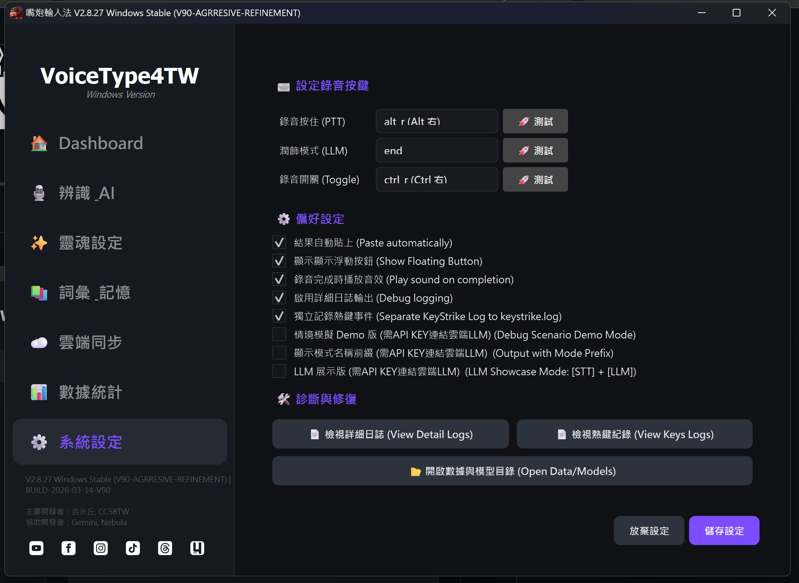

# VoiceType4TW 嘴炮輸入法 — Windows 開發版

> 本 repo 是 [`jfamily4tw/voicetype4tw-mac`](https://github.com/jfamily4tw/voicetype4tw-mac) 的 fork（基於其 `win-stable` 分支 v3.0.1），**只專注於 Windows 10/11 版本的開發與改良**。
>
> 原作者：吉米丘（Jimmy）、CC58TW。macOS 版本、官方安裝包與教學影片等內容，以[原專案](https://github.com/jfamily4tw/voicetype4tw-mac)的最新說明為準。

「出一張嘴就能打字」的本地優先語音輸入法：全域快捷鍵錄音 → 本地 Faster-Whisper（或雲端引擎）辨識 → 可選 LLM 潤飾 → 自動貼回目前輸入焦點。

---

## 🚀 快速安裝（三步驟，不需要懂程式）

**1. 下載 ZIP**：[👉 點我直接下載](https://github.com/SanHsien/voicetype/archive/refs/heads/main.zip)（或按上方綠色 **Code** 按鈕 → **Download ZIP**）

**2. 解壓縮**到簡單的路徑，例如 `D:\VoiceType4TW`（請避開 `C:\Program Files`，寫入權限不足會被環境檢查擋下）

**3. 雙擊 `setup_win.bat`**，接下來全自動：
- 沒裝 Python？自動下載可攜式 Python（免管理員權限、不污染系統）
- 有 NVIDIA 顯示卡自動啟用 CUDA 加速，沒有就用 CPU 模式（省 800MB 下載）
- 自動下載語音辨識模型（約 1.5GB）、編譯啟動器、建立桌面捷徑


需要網路，視網速約 10～30 分鐘。完成後雙擊桌面「**嘴炮輸入法**」捷徑即可使用。

> 💡 若雙擊時 Windows 跳出藍色「已保護您的電腦」視窗，點「其他資訊」→「仍要執行」即可（網路下載的檔案都會如此，之後不會再出現）。
> 疑難排解請見下方「安裝失敗排除」章節與 [安裝下載教學](安裝下載教學.md)。

---

## 功能特色（Windows）

- **一鍵安裝**：`setup_win.bat` 自動下載可攜式 Python、偵測 NVIDIA GPU 條件安裝 CUDA。
- **全域快捷鍵**：按住說話（PTT）或切換開關（Toggle）。
- **全時模式**：VAD 偵測語音自動切句辨識，免按鍵。
- **本地辨識**：Faster-Whisper，支援 CUDA 加速；亦可選 Groq / Gemini / OpenRouter 雲端引擎。
- **麥克風裝置選擇＋增益＋AGC**：多台麥克風（耳機/USB/內建）可在設定頁切換，支援插拔自動偵測；手動增益（50~300%）與自動增益（AGC）可獨立開關。
- **三層式靈魂系統**：基底靈魂＋情境模板＋輸出格式，經 LLM 潤飾語氣風格。
- **多螢幕跟隨、位置記憶、不搶焦點注入、智慧詞彙學習、即時翻譯魔術語**。

## 功能導覽


### 工作流程

1. 按下你設定好的快捷鍵開始講話
2. 系統透過本地 Whisper 或雲端引擎進行語音辨識
3. 可選擇直接輸出文字，或先丟給 LLM 做潤飾、整理口氣、調整風格
4. 輸出結果自動送回目前有輸入焦點的應用程式
5. 若使用魔術語，則會在流程中自動進行翻譯後再輸出

### 浮動錄音狀態視窗


- 左側沒有 AI 字樣：直接辨識、輸出
- 左側有 AI 字樣：透過 LLM 修飾完成之後再輸出
- 黃色模式：語音講完後開始辨識
- 翻譯成英文／日文：直接講中文，輸出對應語言

### 辨識與 AI 設定


選擇語音引擎（本地 Whisper／Groq／Gemini／OpenRouter）、模型大小，以及 AI 潤飾使用的 LLM（Ollama 本地或 OpenAI／Claude／Gemini 等雲端）。

### 靈魂治理：三層疊加系統


可自由調配 AI 的「靈魂組成」：

1. **🏠 基底靈魂 (Base)**：定義 AI 的核心價值觀，例如：不廢話、修正錯字、繁體中文輸出。
2. **🎭 情境模板 (Scenario)**：定義特定場合的對話風格，如：`💼 商務回應`、`🌐 商務英文`、`📱 社群貼文`。
3. **📝 輸出格式 (Format)**：決定最後呈現的樣子，例如：電子郵件格式、條列式筆記、Markdown 表格。

透過系統匣選單可以隨時組合不同靈魂，讓輸入法真正成為你的私人助理。

### 詞彙記憶


可手動輸入想要辨識的專有名詞（如客戶品牌名稱）；同一詞彙出現三次以上會自動記錄。每週會把當週記憶濃縮另存，持續保有長期記憶。

### 連同靈魂情境一起翻譯

翻成英文、翻成日文與恢復原狀三個選項，可疊加在靈魂注入後的結果上——選擇扮演哪個靈魂，再用什麼語言輸出。

### 自定同步資料夾


把設定放在你的同步目錄（iCloud、Google Drive、NAS 都可以），讓記憶與常用詞彙跨機器共用。

### 數據統計


記錄輸入的語音總長度，換算一般人平均打字速度，統計幫你省下多少時間。

### 系統設定



設定觸發快捷鍵（按住錄音 PTT 或單擊開關 Toggle）、結果自動貼上（同時存入剪貼簿，沒自動貼上時按 Ctrl-V 即可）、詳細輸出（Terminal 除錯用）。「診斷與修復」區塊可測試麥克風、一鍵匯出診斷包（環境資訊、裝置清單、日誌片段、已去除 API Key 的設定摘要打包成桌面 zip），方便回報問題。

## 🛠️ 安裝失敗排除

若執行 `setup_win.bat` 時卡在「建立虛擬環境」或「安裝依賴」階段，通常與 **磁碟寫入權限** 有關。

**❌ 常見成因：安裝在受保護目錄**
- 路徑在 `C:\` 根目錄、`C:\Program Files` 或 `C:\Program Files (x86)`
- Windows 會限制未授權腳本在這些位置寫入大量小檔案

**✅ 解決方案（擇一）：**
1. **更換安裝路徑（推薦）**：整個資料夾移至 D 槽等非系統磁碟，例如 `D:\Tools\VoiceType4TW`
2. **移到使用者資料夾**：只有 C 槽的話，放在 `C:\Users\<你的名稱>\Documents` 或桌面
3. 對 `setup_win.bat` 按右鍵 →「以系統管理員身分執行」

模型下載卡住的手動處理方式請見 [安裝下載教學](安裝下載教學.md)。

## 開發環境安裝

需 Python 3.10–3.12：

```bat
git clone https://github.com/SanHsien/voicetype.git
cd voicetype

py -3.12 -m venv venv
venv\Scripts\activate

pip install -r requirements-win.txt
rem 有 NVIDIA GPU 才需要下一行
pip install -r requirements-cuda-win.txt

python main.py
```

一般使用者安裝：執行 `setup_win.bat`（勿放在 `C:\` 根目錄或 `Program Files` 等受保護路徑，建議放使用者資料夾或非系統磁碟）。

打包可攜 ZIP（開發者）：

```powershell
.\release_win.ps1            # Full：含 CUDA + medium 模型（約 4GB）
.\release_win.ps1 -Lite      # Lite：無 CUDA 無模型，首次啟動線上下載（約 300MB）
.\release_win.ps1 -NoModel   # NoModel：含 CUDA、無模型，首次啟動線上下載（約 1-1.5GB）
```

推送 `v*` tag 會觸發 `.github/workflows/release.yml` 自動建置 Lite + NoModel 兩版並發佈到 GitHub Releases（`workflow_dispatch` 手動觸發僅產生 artifact，不發佈）；`.github/workflows/dependency-freshness.yml` 每月檢查 `requirements-win.txt`/`requirements-cuda-win.txt` 是否落後 PyPI 最新版。

## 設定

設定檔位於 `%APPDATA%\VoiceType4TW\`（`config_local.json` 本機、`config_global.json` 參與雲端同步），多數選項可在設定視窗調整：

| 欄位 | 說明 | 預設值 |
|------|------|--------|
| `hotkey_ptt` | 按住說話快捷鍵（alt_r / ctrl_r / shift_r / f13-f15 / code:VK） | `alt_r` |
| `hotkey_toggle` | 切換開關快捷鍵 | `f13` |
| `auto_trigger_enabled` | 全時模式（免按鍵自動觸發） | `false` |
| `stt_engine` | 語音引擎（local_whisper / groq / gemini / openrouter） | `local_whisper` |
| `whisper_model` | Whisper 模型大小（tiny/base/small/medium/large） | `medium` |
| `mic_device` | 麥克風輸入裝置（sounddevice 裝置索引，`null`=系統預設，機器特定不雲端同步） | `null` |
| `mic_gain` | 麥克風手動增益（50~300，100=不變，機器特定不雲端同步） | `100` |
| `mic_gain_auto` | 是否啟用 AGC 自動增益（機器特定不雲端同步） | `true` |
| `llm_enabled` | 是否啟用 AI 文字潤飾 | `false` |
| `llm_engine` | LLM 引擎（ollama / openai / claude / openrouter / gemini / deepseek / qwen） | `ollama` |
| `openrouter_model` | OpenRouter 模型（找不到會依序 fallback） | `google/gemini-2.5-flash` |
| `language` | 辨識語言 | `zh` |

## 系統需求

- Windows 10/11（沒裝 Python 也行，`setup_win.bat` 會自動抓可攜式 Python 3.12，免系統管理員權限）
- NVIDIA GPU 自動啟用 CUDA 加速，無 GPU 自動改用 CPU 模式
- 記憶體建議 16GB 以上
- 磁碟空間約 5GB（含辨識模型）

## 本 fork 的文件

- [AGENTS.md](AGENTS.md)（AI 協作規則）、[SKILL.md](SKILL.md)（agent 快速上手）
- [docs/DEVELOPMENT.md](docs/DEVELOPMENT.md)（開發指南）、[docs/DECISIONS.md](docs/DECISIONS.md)（決策記錄）
- [REVIEW.md](REVIEW.md)（最新一次專案覆核）
- [NOTICE.md](NOTICE.md)、[LICENSE](LICENSE)（授權：MIT，詳見 NOTICE.md）

本文件僅涵蓋 Windows 開發版的必要資訊；本文未盡事項（完整功能介紹、安裝疑難排解、macOS 版等），以[原專案](https://github.com/jfamily4tw/voicetype4tw-mac)的最新說明為準。本 fork 為獨立維護，不代表原專案立場。
