# VoiceType4TW 嘴炮輸入法 (v2.9.7 Mac版)

主要開發者：吉米丘 , CC58TW 
協助開發者：Claude、Gemini、Nebula

吉米與女兒CC58TW全新開發的嘴炮輸入法，讓你出一張嘴就能打字的輸入法

免費版歡迎大家測試使用，GitHub開源的Python版，想自己抓下來研究、裝在電腦裡都OK


目前有macOS有三個版本：

Github版：原始碼全部開源，想玩的自己去下載安裝，完全免費，但無法提供技術支援，需要麻煩各位高手自己研究解決

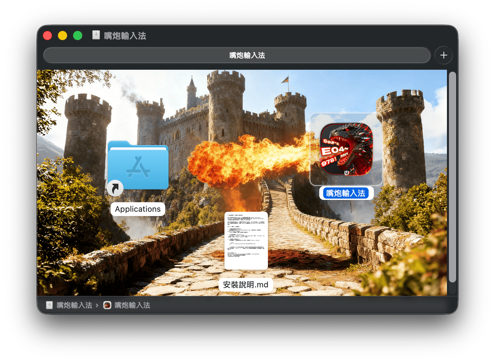

DMG 免費版：打包成DMG直接下載，拖入左邊的應用程式，再依照安裝說明或是我提供的影片來繞過Apple的限制就可以使用，有語音辨識STT，也有底層靈魂可以設定，與咖啡版差別在於沒有多個靈魂可以選擇注入，👉 [下載連結](https://portaly.cc/jimmy4tw/product/AcZCAt5kVqhnmLFYCYIY) (內有Universal版 2.8.26K 與 Apple Sillicon版)

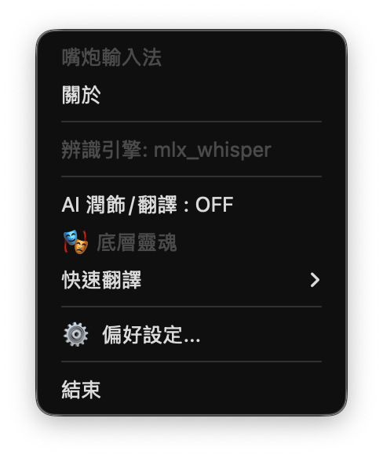

DMG 咖啡版：為了感謝 Buy me a coffee的朋友，所以這個版本不只有底層靈魂可以注入，還可以有多個靈魂可以自行定義後選擇注入，👉 [下載連結](https://portaly.cc/jimmy4tw/product/9lXTA2fYnspWugYuUvAL) (內有Universal版 2.8.26K 與 Apple Sillicon版)

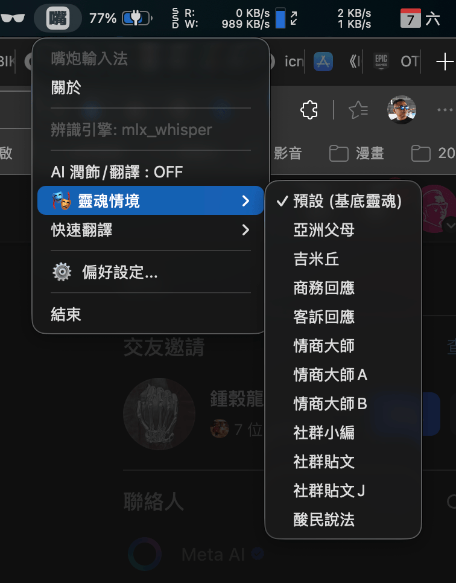 


Windows只有兩個版本：

Github版：原始碼全部開源，想玩的自己去下載安裝，完全免費，但無法提供技術支援，需要麻煩各位高手自己研究解決 👉 [Windwos](https://github.com/jfamily4tw/voicetype4tw-mac/tree/win-stable)

Win 咖啡版：為了讓大家一鍵安裝到好，我搞了三天弄了90個版本終於搞定，所以有需要的自行決定要哪個版本吧 👉[下載連結](https://hi.jimmy4.tw/product/Ow5uKOdcHzgsyxMc8XE6)


---

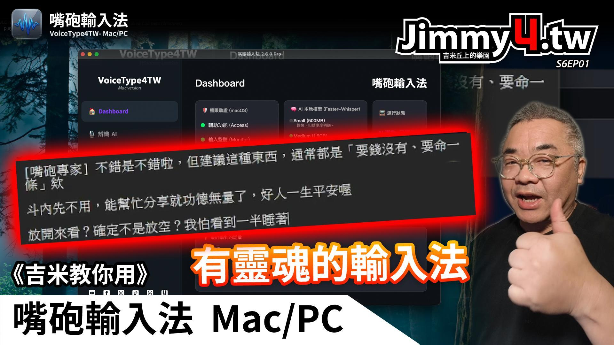

👉 [點我觀看完整影片](https://www.youtube.com/watch?v=gZA-GSiRJqw)


---

## 為什麼做這套工具

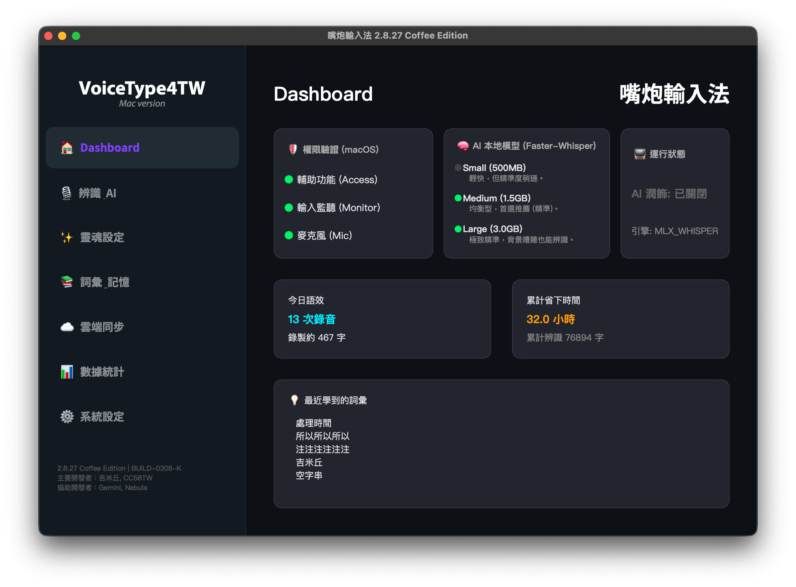

靈感來自TypeLess這類語音輸入工具，但因為授權限制與雲端依賴，我就想：能不能做一套「完全可以在本地端自己掌握」的語音輸入工具  
於是就結合Apple Silicon的本地Whisper能力，再加上Gemini、Nebula等AI夥伴，一起打造出這套專為Mac打造的VoiceType4TW，也就是嘴炮輸入法

---

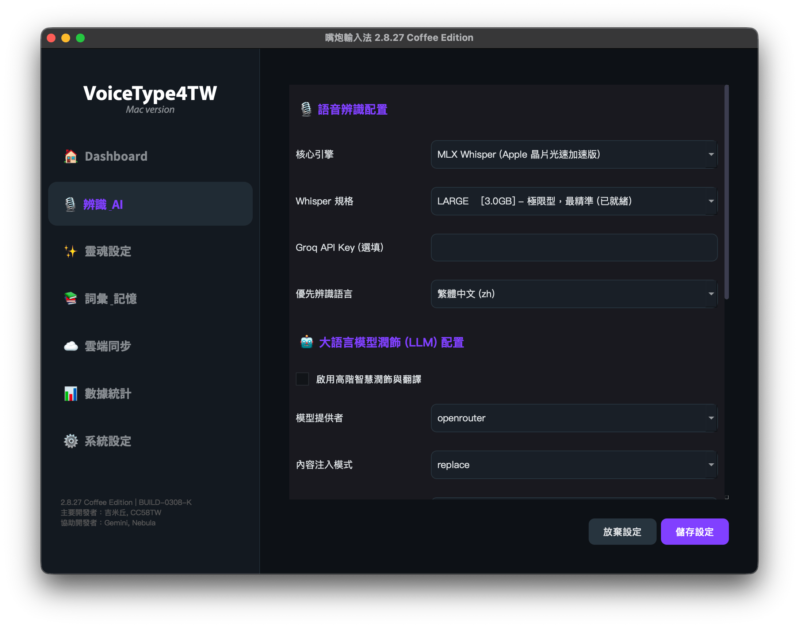

## 功能特色

- **跨平台支援**：全新重構，原生支援 macOS (Universal) 與 Windows 10/11。
- **全域快捷鍵**：按住說話 (PTT) 或 切換開關 (Toggle)，反應迅速不卡頓。
- **神經級辨識**：搭載本地 Faster-Whisper，支援各平台硬體加速。
- **✨ 多螢幕跟隨**：Indicator 會自動偵測滑鼠位置並出現在對應螢幕。
- **🔵 完成感官優化**：貼回文字時觸發亮藍色閃爍與音效 (可於設定關閉)。
- **✨ 三層式靈魂系統**：結合「基底靈魂 + 情境模板 + 格式決定」，打造個人化 AI 風格。
- **⚡️ 旗艦預設情境**：隨附商務英文、專業回應、社群貼文、情商大師等優質人格。
- **Instant Translation 魔術語**：用語音即時切換翻譯模式，無需動手操作設定。
- **不搶焦點設計**：深度優化視窗屬性，確保文字直接精準注入當前編輯位置。
- **智慧詞彙學習**：自動記憶專有名詞與常用關鍵字。

---

## 浮動錄音狀態視窗

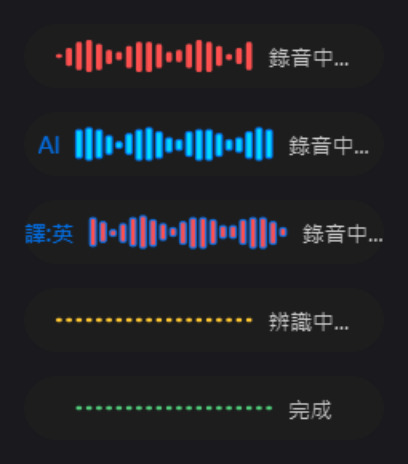

這裡有多種模式呈現

- 左側沒有AI的字樣，直接辨識、輸出
- 左側有AI的部分，透過LLM做修飾完成之後再輸出
- 黃色模式，當我們的語音講完之後，它就開始做辨識
- 翻譯成英文，當你直接講中文，它就會翻譯成英文
- 翻譯成日文，當你直接講中文，它就會翻譯成日文


---

## ✨ 靈魂治理：三層疊加系統

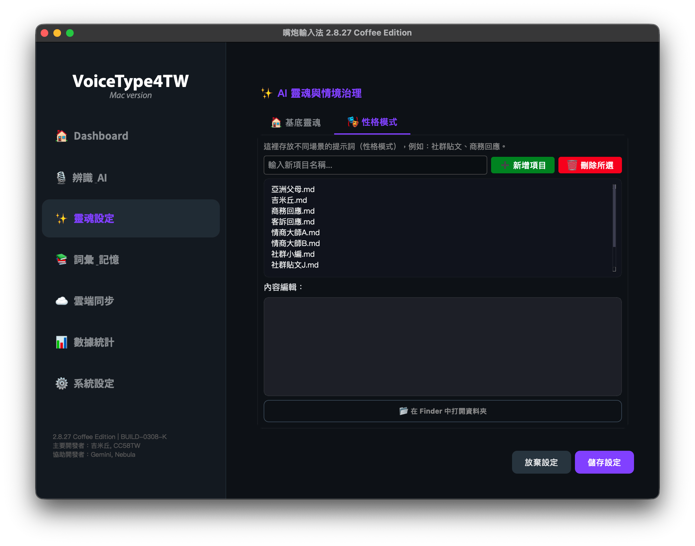

這套系統最核心的特色在於您可以自由調配 AI 的「靈魂組成」：

1.  **🏠 基底靈魂 (Base)**：定義 AI 的核心價值觀，例如：不廢話、修正錯字、繁體中文輸出。
2.  **🎭 情境模板 (Scenario)**：定義特定場合的對話風格，如：`💼 商務回應`、`🌐 商務英文`、`📱 社群貼文`。

透過 Menu Bar 可以隨時組合不同靈魂，讓輸入法真正成為您的私人助理。

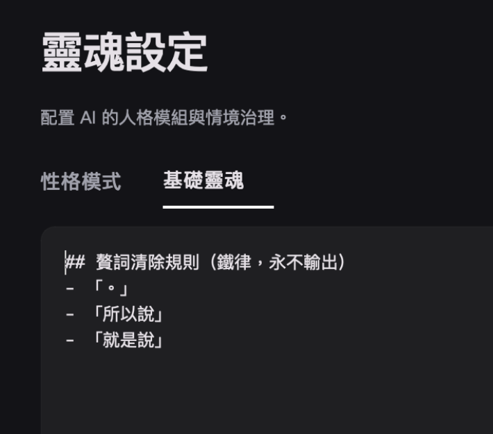

2.9.7版起，基底靈魂將會疊加於所有靈魂上，你常說的口頭禪、贅詞都可以在這裡設定消除掉

---

## 詞彙記憶

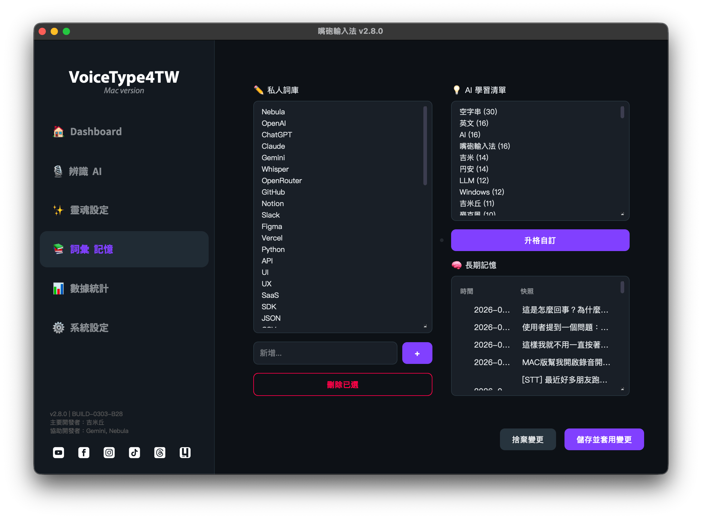

因為吉米常常需要輸入一些專有名詞，或者是客戶的品牌名稱，所以我在這個地方設計了一個詞彙新增的功能，可以手動輸入我們想要辨識的專有名詞

甚至我這邊是設定了，當一個詞彙出現三次以上，他會自動把它記錄起來

因為有了「養龍蝦」觀念的經驗之後，我也希望它能夠擁有一個長期記錄

每一週，它會去把當週所有的記憶做一個濃縮之後再另存起來，讓它持續保有我們之前所有的記憶

我的想法是這樣子啦


---


## 連同靈魂情境一起翻譯

我設定了翻成英文、翻成日文與恢復原狀等三個選項

這些翻譯可以疊加在上面靈魂注入後的結果，所以可以選擇扮演哪個靈魂，然後用什麼語言輸出


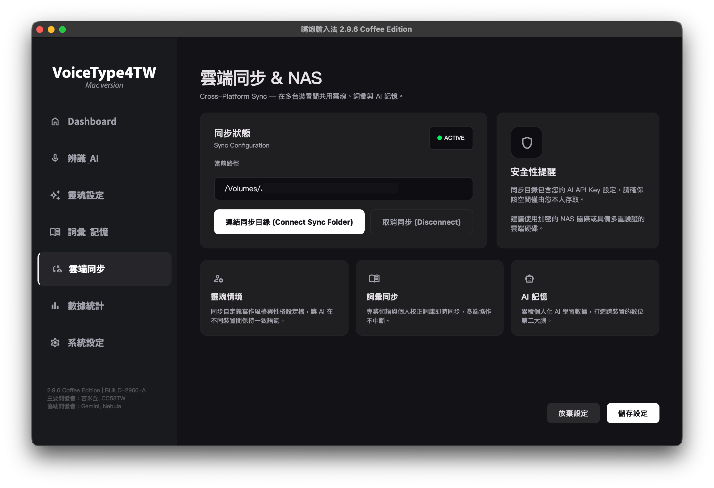

## 自定同步資料夾

因為我常常需要在Mac跟PC的之間切換，所以我希望我的記憶跟常用的這些詞彙可以共用，因此我設計了雲端目錄夾同步的一個概念。

只要你把它設定在你的同步的目錄，不管你是用iCloud、是用Google Drive、是用NAS來做同步都可以。

---

## 數據統計

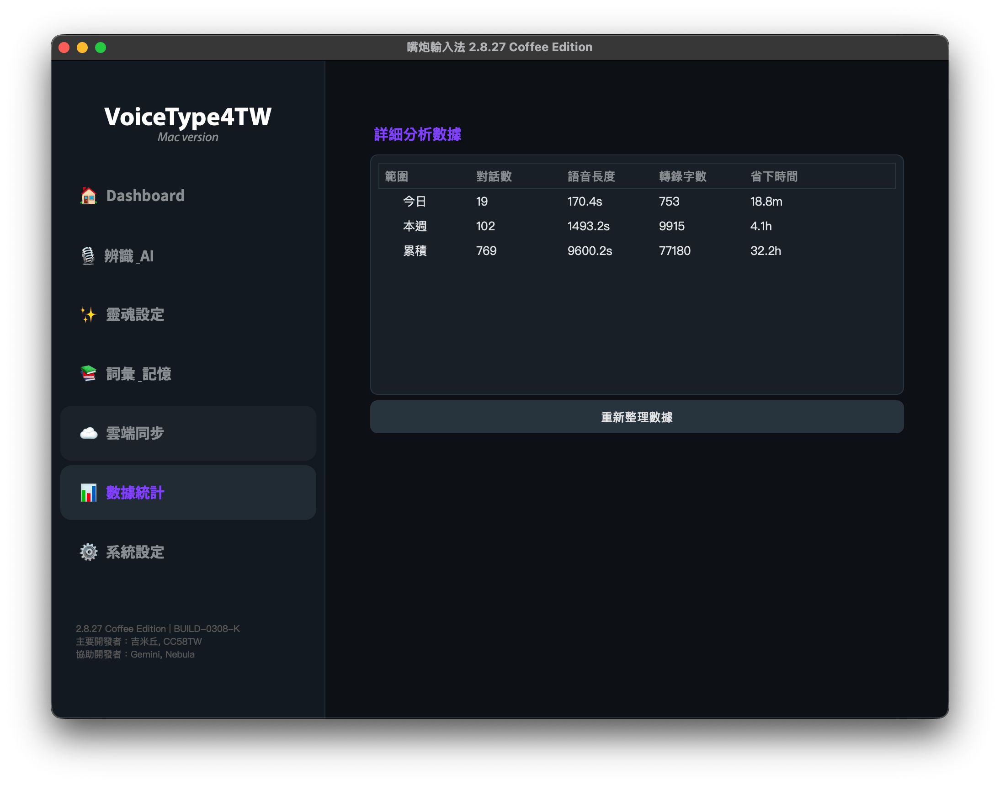

這套系統會記錄你輸入了多少語音，語音總長度是多少，然後再除以一般人平均每分鐘的打字字數，總結出幫你省下多少時間的統計。

希望讓大家長久使用下來，能夠看到一個漂亮的數據！

---

## 系統設定

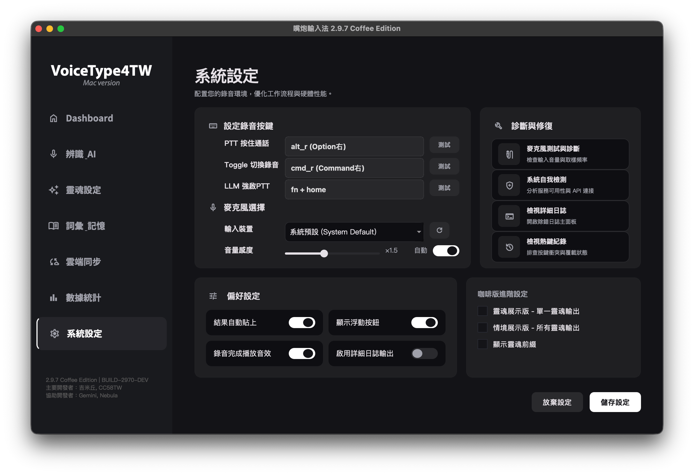

設定成要按哪個按鈕來觸發語音輸入法的設定頁面。在這個地方可以設定按住錄音 (PTT) 或 單擊開關 (Toggle) 的運作方式。

結果自動貼上，這玩意兒就是會把我們輸入之後的文字，自動貼上我們所在Focus的視窗輸入頁面上面，同時也會存在剪貼簿裡面。

如果說它沒有出現的話，你只要直接按Ctrl-V貼上就可以了。

然後，如果你是喜歡看這個輸出結果的話，你可以啟用詳細一日制輸出，這個只有在Terminal的視窗上面會出現，這是我們在Debug的時候使用的。


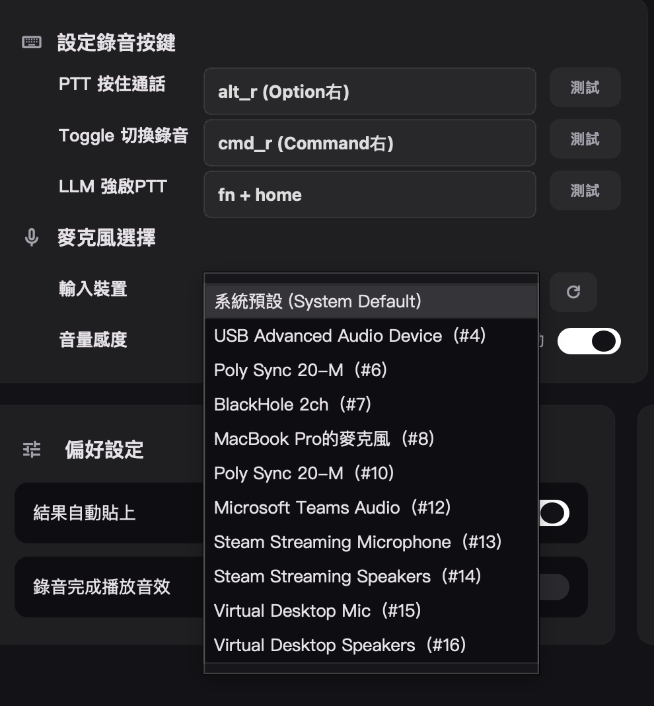

感謝網友 [peitang](https://github.com/peitang) 提供建議，2.9.7版加上麥克風設備選項

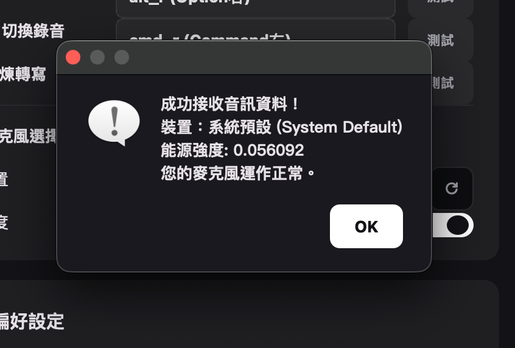

並且可以對麥克風進行測試

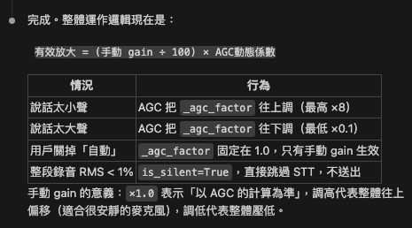

並且優化麥克風收音音量大小邏輯，可以自動增益或是降低收音電平，也可以自己決定音量感度，或是自動平衡

---

## 工作流程

1. 按下你設定好的快捷鍵開始講話  
2. 系統透過本地Whisper或Groq雲端進行語音辨識  
3. 可選擇直接輸出文字，或先丟給LLM做潤飾、整理口氣、調整風格  
4. 輸出結果自動送回目前有輸入焦點的應用程式  
5. 若使用魔術語，則會在流程中自動進行翻譯後再輸出  

---

---

## 💻 各平台快速安裝

### macOS (Apple Silicon / Intel)
打開終端機，貼上這行指令：
```bash
curl -fsSL https://raw.githubusercontent.com/jfamily4tw/voicetype4tw-mac/main/install.sh | bash
```

#### 🔍 麥克風權限與無聲診斷

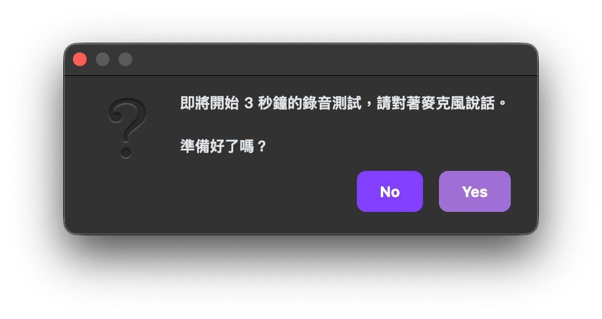

若安裝後錄音「沒有聲音」或「權限無法取得」，請在終端機執行診斷腳本：
```bash
python3 diagnose_mic.py
```
若顯示授權正常但仍無聲，請執行修復指令並重啟：
```bash
tccutil reset Microphone
```

### Windows (v2.8.27 正式版)
另開分支分享 https://github.com/jfamily4tw/voicetype4tw-mac/blob/win-stable/README.md

---

## 手動安裝

如果你想自己來，也可以手動操作：

```bash
# 1. Clone 專案
git clone https://github.com/jfamily4tw/voicetype4tw-mac.git
cd voicetype4tw-mac

# 2. 建立虛擬環境
python3 -m venv venv
source venv/bin/activate

# 3. 安裝依賴
pip install -r requirements.txt

# 4. 啟動
python main.py
```

> ⚠️ 首次執行時，macOS 會詢問你是否允許「終端機」使用麥克風與輔助使用權限，請務必允許。  
> 路徑：系統設定 → 隱私權與安全性 → 麥克風 / 輔助使用

### 🔒 MLX 版本鎖定（重要！打包前必看）

打包 .app 前必須確認 MLX 版本在 `>=0.29,<0.30` 範圍。

**為什麼**：MLX 0.30+ 的 wheel 是 `macosx_26_0_arm64`，內建的 `mlx.metallib` 用 Metal Shading Language 4.0 編譯，**只能在 macOS 26+ 載入**。如果你的開發機是 macOS 26 而 `pip install` 抓到 0.30+，打出來的 .app 會讓所有 macOS 13/14/15 使用者啟動時崩潰（`RuntimeError: Unable to load kernel ... using language version 4.0 which is incompatible with this OS`）。

**確認版本**：
```bash
/Library/Frameworks/Python.framework/Versions/3.12/bin/python3.12 -m pip show mlx | grep Version
# 應該看到：Version: 0.29.4（或其他 0.29.x）
```

**如果版本太新（>=0.30），降回 0.29.4**：
```bash
/Library/Frameworks/Python.framework/Versions/3.12/bin/python3.12 -m pip install 'mlx==0.29.4'
```

`build_all.sh` 內建 `scripts/pre_build_check.py` 守衛，發現 MLX 太新會直接 fail 不繼續 build，所以你不會不小心做出壞的 DMG——但如果你直接呼叫 `setup.py py2app` 繞過 build_all.sh 就沒這層保護。**升 MLX 到 >=0.30 必須開新 Spectra change 並在 design.md 解釋是否要放棄 macOS 13/14/15 支援**。

詳見 `openspec/specs/mlx-version-pin/spec.md`（或對應 archived change）。

---

## 設定

編輯 `config.json`：

| 欄位            | 說明                                                | 預設值          |
|-----------------|-----------------------------------------------------|-----------------| 
| `hotkey`        | 快捷鍵(right_option / right_shift / right_ctrl / f13-f15) | `right_option` |
| `trigger_mode`  | 觸發模式(push_to_talk / toggle)                    | `push_to_talk`  |
| `stt_engine`    | 語音引擎(local_whisper / mlx_whisper / groq)       | `local_whisper` |
| `whisper_model` | Whisper模型大小(tiny/base/small/medium/large)      | `medium`        |
| `groq_api_key`  | Groq API Key(使用groq引擎時填入)                  | `""`            |
| `llm_enabled`   | 是否啟用AI文字潤飾                                 | `false`         |
| `llm_engine`    | LLM引擎(ollama / openai / claude)                  | `ollama`        |
| `language`      | 辨識語言                                           | `zh`            |

---

## 系統需求

- **macOS** 12+ (Apple Silicon)。
- **Windows** 10/11 (Python 3.10+，推薦搭配 NVIDIA GPU 以使用 CUDA 加速)。會另開github  分支    
- **記憶體**: 建議 16GB 以上。

---

## 支援與回饋


如果你覺得嘴炮輸入法對你有幫助，歡迎：

- 在GitHub按顆星支持  
- 分享給身邊常需要打字、開會做紀錄、寫文件的朋友  
- [請吉米喝杯咖啡、小額贊助，支持持續開發](https://hi.jimmy4.tw/support)

有任何功能建議、或想一起共創的點子，都可以：

- 直接在GitHub開Issue  
- 透過吉米的SNS管道來找我聊聊  
