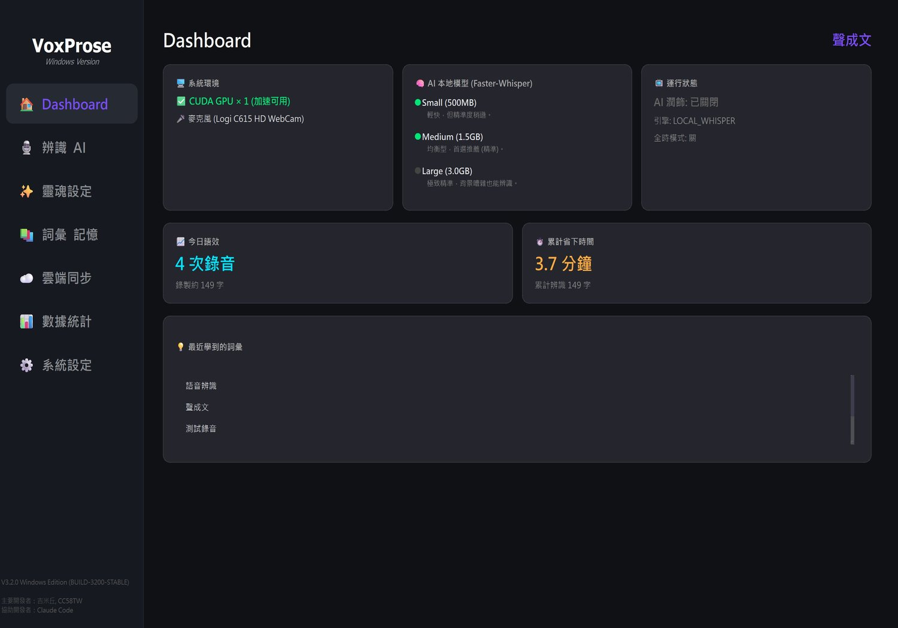
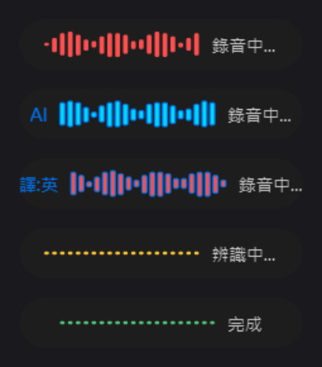
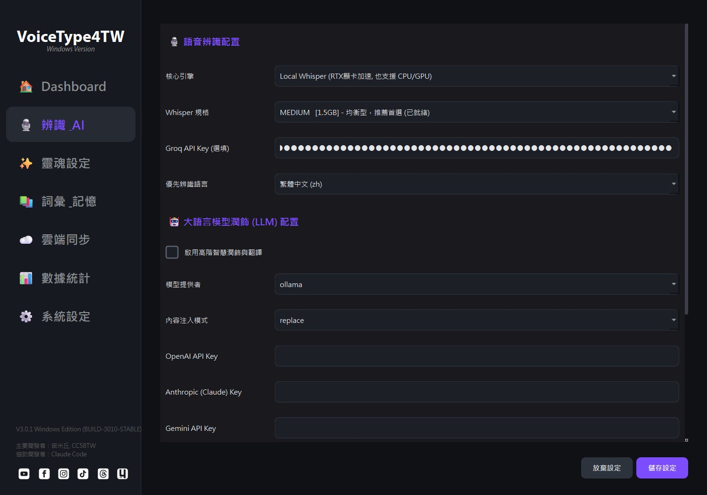
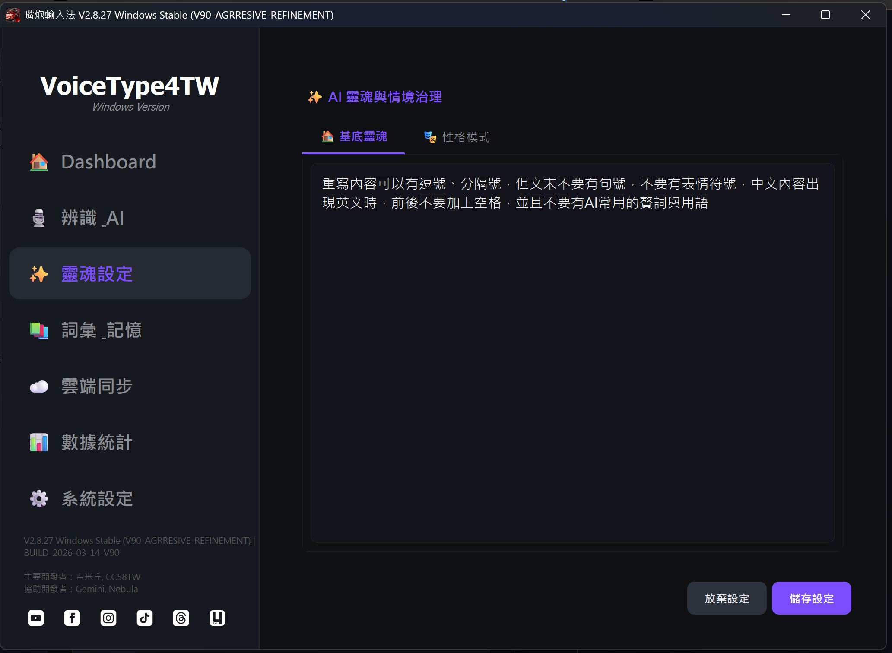
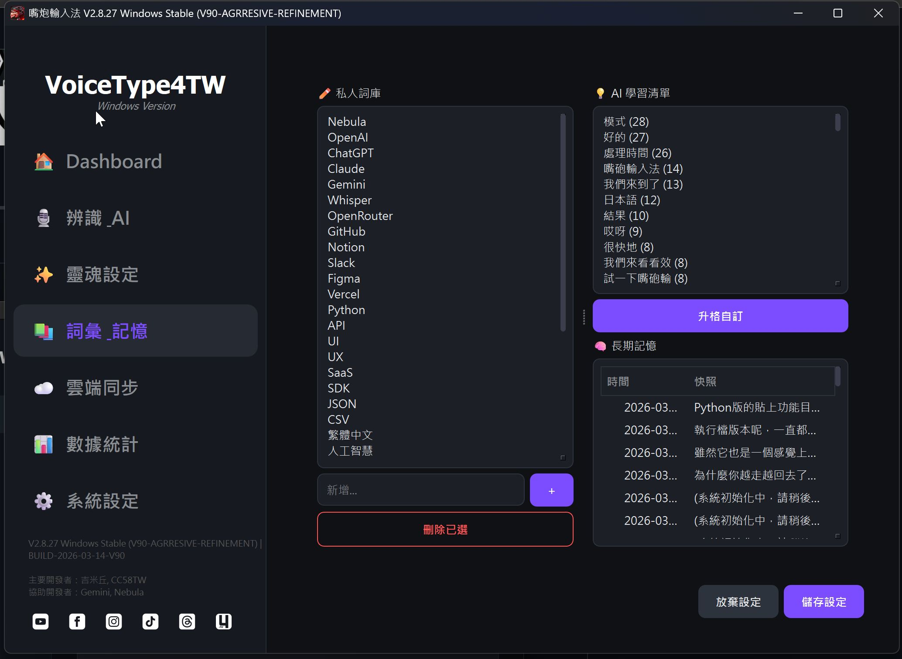

<div align="center">

# 聲成文 VoxProse

**Windows 本機優先 AI 語音輸入：說話 → Whisper 辨識 → 可選 AI 潤飾／翻譯 → 直接輸入目前視窗。**

**自然開口，清楚成文。**

[](https://github.com/SanHsien/voxprose/releases/latest)
[](https://github.com/SanHsien/voxprose/actions/workflows/ci.yml)
[](https://github.com/SanHsien/voxprose/actions/workflows/codeql.yml)
[](LICENSE)
[](pyproject.toml)
[](https://www.microsoft.com/windows/)

[下載最新版](https://github.com/SanHsien/voxprose/releases/latest) · [安裝與模型下載](安裝下載教學.md) · [English](README.en.md)

</div>



VoxProse 是一套只專注 **Windows 10/11** 的語音輸入工具。按住或切換全域快捷鍵開始說話，程式用本機 Faster-Whisper（或你自行選擇的雲端 STT）轉成文字；需要時再交給 LLM 做潤飾、格式整理或翻譯，最後把結果送回目前有輸入焦點的應用程式。

它適合希望「少打字、多說話」，但仍想保留本機辨識、可控雲端服務與自訂輸出格式的人。

## 主要特色

- **在任何程式說話打字**：LINE、瀏覽器、Office、聊天工具或其他有輸入焦點的視窗都能使用。
- **本機 Whisper 優先**：預設可使用 Faster-Whisper，在 CPU 或 NVIDIA CUDA 上執行。
- **可選雲端辨識**：自備 API key 使用 Groq、Gemini 或 OpenRouter STT。
- **可選 AI 潤飾與翻譯**：辨識後再用 Ollama 或 OpenAI、Claude、Gemini、OpenRouter 等 LLM 整理文字。
- **三層式文字風格系統**：Base（基底）＋ Scenario（情境）＋ Format（格式），讓相同語音依工作場合輸出不同風格。
- **依前景程式切換情境**：例如 Outlook 自動套用商務回應、LINE 套用較口語的情境；此功能預設關閉。
- **PTT、Toggle 與全時模式**：可按住說話、按一下開關，或用 RMS／Silero VAD 自動偵測語音。
- **詞彙記憶與診斷**：記住常用專有名詞，並可匯出已移除 API key 的診斷包協助除錯。

## 下載

前往 [Latest Release](https://github.com/SanHsien/voxprose/releases/latest)。目前正式發佈提供兩種 Windows 可攜 ZIP：

| 套件 | 適合對象 |
|---|---|
| `ShengChengWen-Windows-Lite-*.zip` | CPU 使用者，或希望先下載較小套件；不含 CUDA 與 Whisper 模型 |
| `ShengChengWen-Windows-NoModel-*.zip` | NVIDIA GPU 使用者；含 CUDA 執行環境，不含 Whisper 模型 |

使用方式：

1. 下載適合的 ZIP 並解壓縮到簡單路徑，例如 `D:\VoxProse`。
2. 執行 `VoxProse.exe`。
3. 首次啟動依畫面下載或選擇語音模型。
4. 設定快捷鍵後，把游標放在要輸入的程式，按快捷鍵說話即可。

Release 同時提供 `.sha256` 校驗檔。發行檔目前未使用 Authenticode 程式碼簽章，因此 Windows SmartScreen 可能顯示未知發行者；請只從本 repo 的 Releases 下載，必要時核對 SHA-256。

### 從原始碼／安裝腳本使用

若不使用 Release ZIP，可下載本 repo 後執行 `setup_win.bat`。它會建立本機 Python 環境、安裝依賴，並依 NVIDIA GPU 條件處理 CUDA。

```bat
git clone https://github.com/SanHsien/voxprose.git
cd voxprose
setup_win.bat
```

請避免放在 `C:\Program Files` 等受保護目錄。模型下載或權限問題見 [安裝與模型下載教學](安裝下載教學.md)。

## 工作流程

```text
全域快捷鍵／VAD
      ↓
錄音
      ↓
本機 Faster-Whisper 或選用雲端 STT
      ↓
（可選）LLM 潤飾／情境／格式／翻譯
      ↓
貼回目前有輸入焦點的 Windows 應用程式
```



辨識完成後可以直接輸出；若啟用 AI 潤飾，文字會先依目前選定的情境與格式處理，再送回前景視窗。

## AI 與隱私邊界

「本機優先」不代表所有模式都永遠離線；實際資料流由你選擇的引擎決定：

| 選擇 | 資料流 |
|---|---|
| 本機 Faster-Whisper | 錄音在本機進行語音辨識 |
| Groq / Gemini / OpenRouter STT | 錄音會送到你選擇的雲端辨識服務 |
| 不啟用 AI 潤飾 | 辨識文字不再送往 LLM |
| Ollama 潤飾 | LLM 處理可留在本機 |
| OpenAI / Claude / Gemini / OpenRouter 等雲端 LLM | 辨識文字與所需 prompt 會送到你選擇的供應商 |

雲端功能皆需由使用者自行設定相對應服務與 API key。若資料敏感，請使用本機 STT，並關閉雲端 LLM 或改用本機 Ollama。

## 常用功能畫面

### 辨識與 AI 設定



可選擇語音辨識引擎、Whisper 模型與文字潤飾引擎。

### 三層式文字風格



- **Base**：長期共用的基本寫作要求。
- **Scenario**：商務、社群、逐字稿等使用情境。
- **Format**：Email、正式文件、條列、社群貼文等輸出格式。

三層可以自由組合；也可選擇依目前前景程式自動套用 Scenario。

### 詞彙記憶



可手動加入專有名詞；系統也能依使用次數累積常用詞，供後續辨識提示使用。

## 系統需求

- Windows 10 / 11
- Python 使用者：支援 Python 3.10–3.14
- NVIDIA GPU 可使用 CUDA；沒有 NVIDIA GPU 也可使用 CPU
- 建議 16 GB 以上記憶體
- 模型與執行環境會占用數 GB 磁碟空間

## 開發與驗證

開發環境、Windows 已知相容性問題、測試、打包與 Release 實機驗證請見 [`docs/DEVELOPMENT.md`](docs/DEVELOPMENT.md)。

基本測試：

```powershell
python -m pytest tests/ -v
```

CI 會在 Windows runner 上測試 Python 3.10、3.11、3.12、3.13、3.14，並進行全 repo `py_compile` 與 pytest。真實麥克風、快捷鍵、CUDA、STT 模型與焦點輸入仍屬 Windows 實機驗證範圍。

## 文件

- [安裝與模型下載教學](安裝下載教學.md)：一般使用者安裝與模型下載問題
- [CHANGELOG.md](CHANGELOG.md)：版本歷史
- [docs/DEVELOPMENT.md](docs/DEVELOPMENT.md)：開發、測試、打包與 Windows 實機驗證
- [docs/DECISIONS.md](docs/DECISIONS.md)：設計與維護決策
- [docs/UPSTREAM.md](docs/UPSTREAM.md)：上游同步紀錄
- [NOTICE.md](NOTICE.md)：來源、署名與第三方聲明

## 專案來源

VoxProse 是 [`jfamily4tw/voicetype4tw-mac`](https://github.com/jfamily4tw/voicetype4tw-mac) 的 Windows-only fork，源自 VoiceType4TW／嘴炮輸入法的 `win-stable` Windows 線。原作者為 **Jimmy Chiou（吉米丘）**與 **CC58TW**，上游 Windows 專用版曾由 **go-mask** 維護；本 fork 由 **SanHsien** 以「聲成文 VoxProse」名稱持續維護。

完整來源與版本脈絡見 [NOTICE.md](NOTICE.md) 與 [docs/UPSTREAM.md](docs/UPSTREAM.md)。本 fork 獨立維護，不代表上游專案立場。

## 授權

本專案採 [MIT License](LICENSE)。使用、修改或散布時請保留授權與必要署名；詳細來源見 [NOTICE.md](NOTICE.md)。
